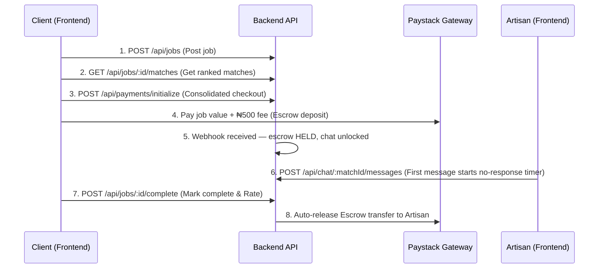

# Artiva Frontend Integration Guide & API Contract

This document provides the complete API contract, payload formats, authentication patterns, and workflow diagrams needed to integrate the Artiva frontend with the Verifix backend.

---

## 1. Environment Configuration

Place the following keys in your frontend environment file (`.env` / `.env.development` / `.env.production`):

```env
# Backend Base API URL
VITE_API_BASE_URL=https://us-central1-artiva-a0594.cloudfunctions.net/api
```

---

## 2. Authentication & User Sync Flow

Every authenticated API request requires the Firebase ID token passed in the Authorization header:

```http
Authorization: Bearer <firebase_id_token>
```

### Authorization Header Helper

```javascript
import { auth } from './config/firebase';

export async function getAuthHeaders() {
  const user = auth.currentUser;
  if (!user) return { 'Content-Type': 'application/json' };
  const token = await user.getIdToken();
  return {
    'Content-Type': 'application/json',
    'Authorization': `Bearer ${token}`
  };
}
```

### A. Send OTP

**Endpoint**: `POST /api/auth/phone/send-otp`

**Payload**:

```json
{
  "phone": "+2348012345678"
}
```

**Response**:

```json
{
  "success": true,
  "message": "OTP sent"
}
```

### B. Verify OTP & Create Session

**Endpoint**: `POST /api/auth/phone/verify-otp`

**Payload**:

```json
{
  "phone": "+2348012345678",
  "otp": "123456"
}
```

**Response**:

```json
{
  "token": "<firebase_id_token>",
  "user": { "uid": "...", "phone": "...", "role": "client" }
}
```

---

## 3. Artisan Onboarding & Directory

### A. Register Artisan Profile

**Endpoint**: `POST /api/artisans`

**Headers**: `Authorization: Bearer <idToken>`

**Payload** (3-step signup — send on final step submission):

```json
{
  "first_name": "Ade",
  "last_name": "Ogunleye",
  "trade": "Plumbing",
  "services": ["Pipe Fitting", "Drain Cleaning", "Water Heaters"],
  "location": {
    "city": "Ikeja",
    "state": "Lagos",
    "lga": "Ikeja",
    "address": "14 Allen Avenue"
  },
  "experience_years": 10,
  "nin": "12345678901",
  "id_document_base64": "data:image/jpeg;base64,...",
  "work_photos_base64": [
    "data:image/jpeg;base64,...",
    "data:image/jpeg;base64,..."
  ]
}
```

### B. Toggle Artisan Availability

**Endpoint**: `PATCH /api/artisans/:uid/availability`

**Headers**: `Authorization: Bearer <idToken>` (artisan only)

### C. Search & Browse Verified Artisans

**Endpoint**: `GET /api/artisans?trade=Plumbing&location=Lagos&available=true`

**Response**:

```json
{
  "success": true,
  "data": [
    {
      "uid": "artisan_123",
      "trade": "Plumbing",
      "reputation_score": 4.9,
      "completed_jobs": 28,
      "work_photos": ["https://storage.googleapis.com/..."]
    }
  ]
}
```

### D. Get Artisan Profile

**Endpoint**: `GET /api/artisans/:id`

**Headers**: `Authorization: Bearer <idToken>`

> `nin` and `id_document_url` are never returned to non-admin callers.

### E. Get Artisan Dashboard

**Endpoint**: `GET /api/artisans/:uid/dashboard`

**Headers**: `Authorization: Bearer <idToken>` (must match `uid`)

**Response**:
```json
{
  "success": true,
  "message": "Dashboard data fetched successfully",
  "data": {
    "held_total": 25000,
    "released_total": 75000,
    "completed_jobs": 4,
    "reputation_score": 4.8,
    "is_verified": true
  }
}
```

### F. Update Artisan Profile

**Endpoint**: `PATCH /api/artisans/:uid/profile`

**Headers**: `Authorization: Bearer <idToken>` (must match `uid`)

**Payload**:
```json
{
  "trade": "Plumbing",
  "location": {
    "city": "Lagos",
    "state": "Lagos",
    "lga": "Ikeja"
  }
}
```

### G. Upload Work Photo

**Endpoint**: `POST /api/artisans/:uid/photo`

**Headers**: `Authorization: Bearer <idToken>` (must match `uid`), `Content-Type: multipart/form-data`

**Payload**:
`file`: The image file (JPG, PNG)

### H. Upload ID Document

**Endpoint**: `POST /api/artisans/:uid/id-document`

**Headers**: `Authorization: Bearer <idToken>` (must match `uid`), `Content-Type: multipart/form-data`

**Payload**:
`nin`: String representation of the National Identity Number
`file`: The image file for the ID document (JPG, PNG, PDF)

---

## 4. Job Lifecycle & Escrow Integration



### Step 1: Create Job

**Endpoint**: `POST /api/jobs`

**Headers**: `Authorization: Bearer <idToken>`

**Payload**:

```json
{
  "trade": "Plumbing",
  "description": "Burst pipe under kitchen sink flooding floor",
  "location": {
    "address": "Block 2, Lekki Phase 1",
    "city": "Lagos",
    "state": "Lagos"
  },
  "urgency": "Today"
}
```

### Step 2: Fetch Matches

**Endpoint**: `GET /api/jobs/:id/matches`

**Headers**: `Authorization: Bearer <idToken>`

### Step 3: Consolidated Escrow Payment via Paystack

> [!IMPORTANT]
> The backend collects job value + ₦500 platform fee in a **single** Paystack transaction. Both amounts are itemized on the checkout screen and receipt. Do not rely on frontend calculations.

**Endpoint**: `POST /api/payments/initialize`

**Headers**: `Authorization: Bearer <idToken>`

**Payload**:
```json
{
  "match_id": "match_uid_456",
  "job_value": 20000
}
```

**Response**:
```json
{
  "message": "Payment initialized successfully",
  "transaction_id": "tx_abc123",
  "authorization_url": "https://checkout.paystack.com/...",
  "access_code": "..."
}
```
*Frontend Action: Redirect the user to the `authorization_url` to complete payment. Paystack will send a webhook to the backend to lock the funds in Escrow and open the in-app chat thread.*

### Step 4: In-App Chat (after payment confirmed)

- Chat is available **only** after the Paystack webhook confirms payment.

### 4. No-Response Auto-Refund & Suspensions

If the assigned artisan does not send an in-app message before the `no_response_timer_expiry` (dynamically set based on job urgency), the system automatically refunds the client. 
- **Urgency "Today":** 2-hour timer.
- **Urgency "This Week":** 4-hour timer.
- **Urgency "Flexible":** 12-hour timer.

The artisan receives a "no-response flag" (`no_response_flags` increments). 
> [!WARNING] 
> If an artisan reaches 2 or more flags, their profile is **automatically suspended** (`verified: false`, `available: false`).

---

### Mark Job Complete
**POST** `/api/jobs/:id/complete`

**Headers**: `Authorization: Bearer <idToken>` (client only)

**Payload**:
```json
{
  "rating": 5,
  "review": "Excellent work on the plumbing"
}
```

### Dispute Job
**POST** `/api/jobs/:id/dispute`

**Headers**: `Authorization: Bearer <idToken>` (client or assigned artisan)

**Payload**:
```json
{
  "reason": "Artisan didn't finish the work properly"
}
```
*Note: This freezes the escrow funds (`DISPUTED`) and alerts admins.*

---

## 5. Admin Queue & Verification Endpoints

- **Fetch Pending Artisans**: `GET /api/admin/verification-queue`
- **Approve Artisan**: `POST /api/admin/verify/:uid`
- **Reject Artisan**: `POST /api/admin/reject/:uid` (Send `{"reason": "..."}`)
- **Platform Stats**: `GET /api/admin/analytics`
- **Non-response Flags**: `GET /api/admin/flags`

---

## 6. Chat & Messaging

**Endpoint Base**: `/api/chat/:matchId/messages`

> [!NOTE]
> Only the Client who created the job and the Artisan assigned to the job have access to these endpoints. Chat is text-only — no media or file sharing.

### Fetch Messages
**GET** `/api/chat/:matchId/messages`

**Headers**: `Authorization: Bearer <idToken>`

**Response**:
```json
{
  "success": true,
  "data": {
    "messages": [
      {
        "id": "msg_123",
        "sender_uid": "user_456",
        "content": "I am on my way!",
        "is_read": false,
        "sent_at": "2024-05-20T10:30:00Z"
      }
    ]
  }
}
```

### Send Message
**POST** `/api/chat/:matchId/messages`

**Headers**: `Authorization: Bearer <idToken>`

**Payload**:
```json
{
  "content": "Are you here yet?"
}
```

---

## 7. Proforma Invoices (Material Escrow)

> [!NOTE]
> For material-inclusive jobs, the artisan never receives raw cash for materials. Instead, a supplier proforma invoice is submitted and the platform pays the supplier directly from escrow.

### Artisan Submits Invoice
**POST** `/api/proforma/submit`

**Headers**: `Authorization: Bearer <idToken>` (artisan only)

**Payload**:
```json
{
  "job_id": "job_123",
  "supplier_name": "Lekki Plumbing Supplies",
  "total_amount": 15000,
  "invoice_document_url": "https://storage.googleapis.com/..."
}
```

### Get Job Proformas
**GET** `/api/proforma/job/:jobId`

**Headers**: `Authorization: Bearer <idToken>` (client or assigned artisan)

**Response**:
```json
{
  "success": true,
  "message": "Proforma invoices fetched successfully",
  "data": {
    "invoices": [
      {
        "id": "prof_abc123",
        "job_id": "job_123",
        "supplier_name": "Lekki Plumbing Supplies",
        "total_amount": 15000,
        "status": "pending",
        "invoice_document_url": "https://storage.googleapis.com/..."
      }
    ]
  }
}
```

### Admin Proforma Endpoints
- **GET** `/api/admin/proforma-queue` — List all pending proformas
- **POST** `/api/admin/proforma/:id/approve` — Triggers direct payout to supplier from escrow
- **POST** `/api/admin/proforma/:id/reject` — Payload: `{"reason": "Invalid pricing"}`
